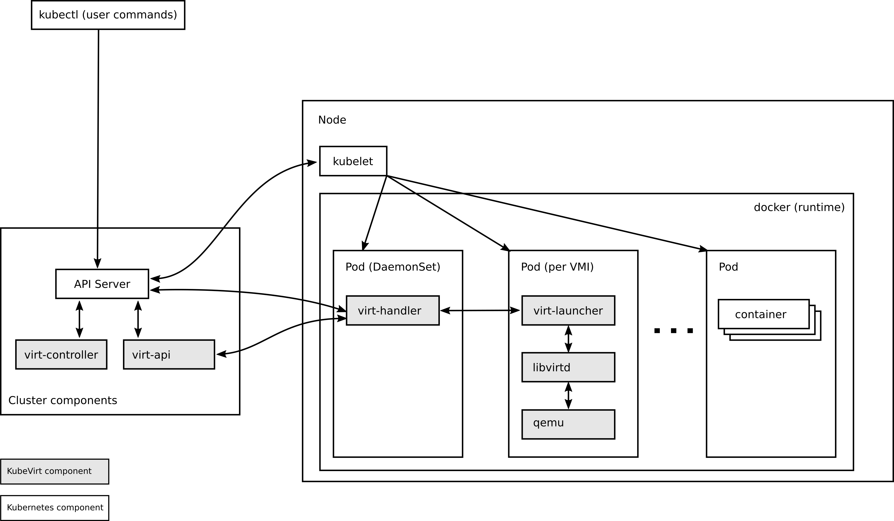

# KubeVirt


KubeVirt 是一个用于在 Kubernetes 中运行虚拟机 (VM) 的项目。它允许在 Kubernetes 集群中同时运行容器和虚拟机，这使得用户可以在同一基础架构上运行容器化应用和虚拟化机器。KubeVirt 的架构由多个组件组成，这些组件通过相互协作来管理和运行虚拟机。以下是 KubeVirt 主要组件的交互关系图：



组件：

1. Virt-API
   * 作用：Virt-API 是 KubeVirt 的 API 服务器组件，负责处理与虚拟机相关的 API 请求。它将这些请求转发给相应的控制器或处理程序。
   * 交互：Virt-API 与 Kubernetes API Server 交互，监听和处理虚拟机自定义资源（例如 VirtualMachine, VirtualMachineInstance）的创建、更新和删除请求。
2. Virt-Controller
   * 作用：Virt-Controller 是一个控制器，类似于 Kubernetes 的 controller-manager，负责管理虚拟机的生命周期。它通过监控和响应 VirtualMachine 和 VirtualMachineInstance 自定义资源的状态变化来创建和删除虚拟机实例,管理和监控 VMI 对象及其关联的 Pod，对其状态进行更新。
   交互：
      * 与 Virt-API 交互，获取虚拟机配置和状态更新。
      * 与 Kubernetes scheduler，确保虚拟机实例被调度到适当的节点上运行。
      * 与 Virt-Handler 交互，管理虚拟机的实际启动、停止等操作。
3. Virt-Handler
   作用：Virt-Handler 是以 DaemonSet 运行在每个 Kubernetes 节点上的守护进程，监听 VMI 的状态向上汇报，负责管理 VMI 的生命周期，例如启动、停止和监控虚拟机实例。
   交互：
   * 与 Virt-Controller 交互，接收控制器的指令来启动或停止虚拟机实例。
   * 直接与虚拟机监控进程 (libvirt/qemu) 交互，执行虚拟机的实际操作。
4. Virt-Launcher
   * 作用：Virt-Launcher 是一个 Kubernetes Pod方式运行，负责在特定节点上运行一个VirtualMachineInstance(虚拟机实例)。每个VirtualMachineInstance 对应一个特定的 Virt-Launcher Pod 。
    交互：
      * 与 Virt-Handler 交互，接收指令并启动虚拟机实例。
      * virt-handler通过将VirtualMachineInstance的CRD对象传递给virt-launcher来通知virt-launcher启动VMI。然后virt-launcher在其容器中使用本地libvirtd实例来启动VirtualMachineInstance。从此开始，virt-launcher将监控VirtualMachineInstance进程，并在VirtualMachineInstance退出后终止；
      * 通过 libvirt 和 QEMU/KVM 管理虚拟机实例的生命周期。

5. libvirtd:
   * 作用：virt-launcher借助于libvirtd管理VirtualMachineInstance生命周期
   * 交互：每个VirtualMachineInstance对应的Pod都有一个libvirtd实例。


## Requirements

在开始之前需要满足一些要求

Kubernetes 群集或衍生物（例如 OpenShift ），基于最新的三个 Kubernetes 发行版之一，该版本是在 KubeVirt 发布时发行的。
这里 KubeVirt 最新版是 1.2.1 ，K8s 选择 1.29.6
Kubernetes apiserver 必须具有-allow-privileged = true，才能运行Kubevirt的特权守护程序。

kubectl  客户端

* 推荐使用 containerd 或 crio (with runv) 容器运行时


## 验证硬件虚拟化支持
建议使用虚拟化支持的硬件。您可以使用 virt-host validate 来确保您的主机能够运行虚拟化工作负载：

安装 virt-host-validate 命令
```shell
# centos7
yum install -y qemu-kvm libvirt virt-install bridge-utils

# ubuntu
apt-get -y install qemu-kvm libvirt-daemon-system libvirt-clients bridge-utils libguestfs-tools virt-viewer virt-manager virtinst
```
验证
```shell
virt-host-validate qemu
QEMU: Checking for hardware virtualization                                 : PASS
QEMU: Checking if device /dev/kvm exists                                   : PASS
QEMU: Checking if device /dev/kvm is accessible                            : PASS
QEMU: Checking if device /dev/vhost-net exists                             : PASS
QEMU: Checking if device /dev/net/tun exists                               : PASS
...
```
在 Kubernetes 上安装 KubeVirt
```shell
# 指定为 v1.2.1 版本
export RELEASE=v1.2.1
# 下载 KubeVirt operator Yaml，并安装
1. KubeVirt Operator
* 作用：KubeVirt Operator 是用于安装和管理 KubeVirt 组件的控制器。它负责部署、升级和维护 KubeVirt 组件，包括 Virt-API、Virt-Controller、Virt-Handler 等。
* 交互：Operator 通过 Kubernetes API 服务器管理和监控所有 KubeVirt 组件的部署和健康状态。
wget https://github.com/kubevirt/kubevirt/releases/download/${RELEASE}/kubevirt-operator.yaml
kubectl apply -f kubevirt-operator.yaml
# 下载 KubeVirt CR， 创建 KubeVirt CR（实例部署请求），该 CR 触发实际安装
wget https://github.com/kubevirt/kubevirt/releases/download/${RELEASE}/kubevirt-cr.yaml
kubectl apply -f kubevirt-cr.yaml
# 等待所有 KubeVirt 组件都启动
kubectl -n kubevirt wait kv kubevirt --for condition=Available
# 下载 virtctl client
wget https://github.com/kubevirt/kubevirt/releases/download/${RELEASE}/virtctl-${RELEASE}-linux-amd64
mv virtctl-${RELEASE}-linux-amd64 /usr/local/bin/virtctl
chmod +x /usr/local/bin/virtctl
```

## Containerized Data Importer
CDI (Containerized Data Importer)项目提供了一些功能，可以通过 DataVolumes 将 pvc (Persistent Volume Claims) 用作 KubeVirt 虚拟机的磁盘。三个主要的CDI 用例是：

* 从 web 服务器或容器注册中心导入磁盘映像到 DataVolume
* 将现有的 PVC 克隆到数据卷
* 上传本地磁盘映像到数据卷

### 安装 CDI
```shell
# 指定 v1.59.0 版本
export VERSION=v1.59.0
# 下载 Yaml 并创建
wget https://github.com/kubevirt/containerized-data-importer/releases/download/$VERSION/cdi-operator.yaml
wget https://github.com/kubevirt/containerized-data-importer/releases/download/$VERSION/cdi-cr.yaml
kubectl create -f cdi-operator.yaml
kubectl create -f cdi-cr.yaml
```

### hostpath 安装
```shell
# hostpath provisioner operator 依赖于 cert manager 提供鉴权能力
$ kubectl create -f https://github.com/cert-manager/cert-manager/releases/download/v1.7.1/cert-manager.yaml

#创建 hostpah-provisioner namespace
$ kubectl create -f https://raw.githubusercontent.com/kubevirt/hostpath-provisioner-operator/main/deploy/namespace.yaml

#部署 operator
$ kubectl create -f https://raw.githubusercontent.com/kubevirt/hostpath-provisioner-operator/main/deploy/operator.yaml -n hostpath-provisioner
$ kubectl create -f https://raw.githubusercontent.com/kubevirt/hostpath-provisioner-operator/main/deploy/webhook.yaml
```


一台从机安装 ubuntu nfs server


| OS           | IP Address     | server     |
|--------------|----------------|------------|
| ubuntu 24.04 | 192.168.10.162 | nfs server |
| ubuntu 24.04 | 192.168.10.163 | master     |
| ubuntu 24.04 | 192.168.10.164 | node01     |
| ubuntu 24.04 | 192.168.10.165 | node02     |

nfs server 节点，安装组件：
```shell
sudo apt-get -y install nfs-kernel-server nfs-common
```

创建共享目录：
```shell
sudo mkdir -p /data/volumes 
```
修改配置文件：
```
cat << 'eof' > /etc/exports
/data/volumes  *(rw,sync,no_root_squash)
eof
# *表示允许所有网段访问
```

重启 nfs server 服务并检查
```
sudo systemctl restart nfs-kernel-server
sudo systemctl enable nfs-kernel-server
sudo showmount -e
```

在所有k8s node节点需要安装组件：
```shell
sudo apt-get -y install nfs-common
```


安装nfs存储插件

nfs-subdir-external-provisioner是一个自动配置卷程序，它使用现有的和已配置的 NFS 服务器来支持通过持久卷声明动态配置 Kubernetes 持久卷。

此组件是对 nfs-client-provisioner 的扩展，nfs-client-provisioner 已经不提供更新，且 nfs-client-provisioner 的 Github 仓库已经迁移到 NFS-Subdir-External-Provisioner 的仓库。

GitHub 地址：https://github.com/kubernetes-sigs/nfs-subdir-external-provisioner

创建 ServiceAccount
```shell
kubectl apply -f nfs-provisioner/nfs-rbac.yaml
```
部署 NFS-Subdir-External-Provisioner
```shell
kubectl apply -f nfs-provisioner/nfs-deployment.yaml -n provisioner
```
创建 NFS SotageClass
```shell
kubectl apply -f nfs-provisioner/storageclass-nfs.yaml -n provisioner

```


virtctl image-upload \
--image-path='rhcos-4.15.23-x86_64-live.x86_64.iso' \
--storage-class hostpath-csi \
--pvc-name=iso-rhcos \
--pvc-size=5Gi \
--uploadproxy-url=https://10.96.2.240 \
   --insecure \
   --wait-secs=240